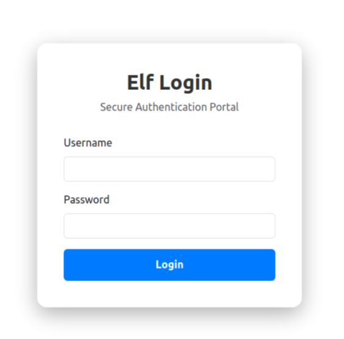
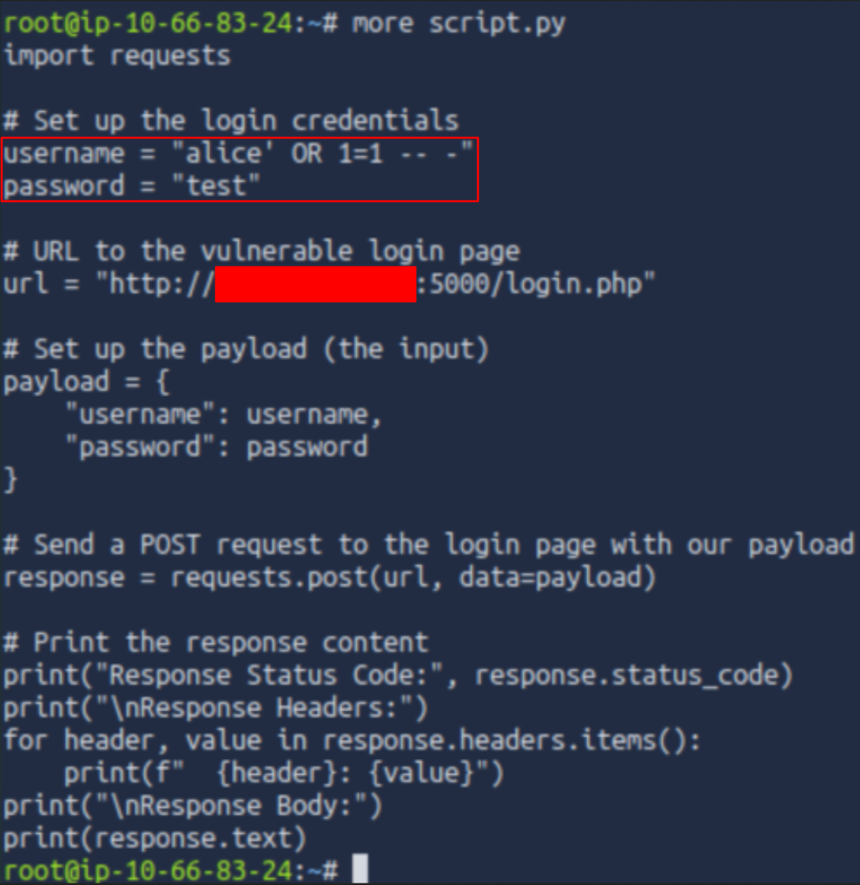
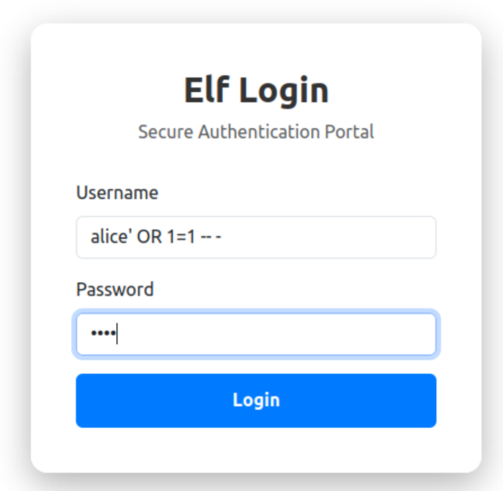
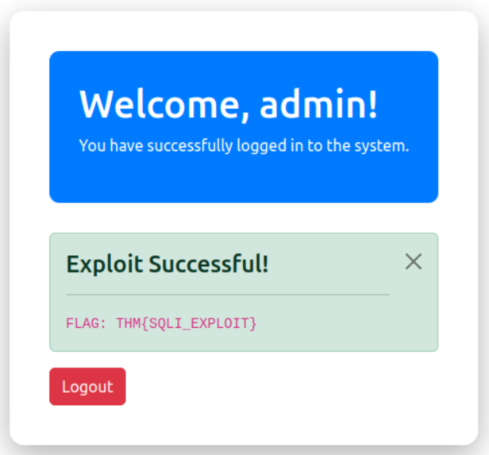
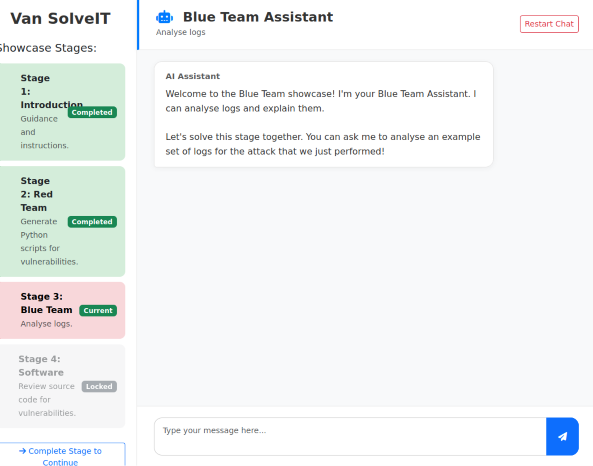
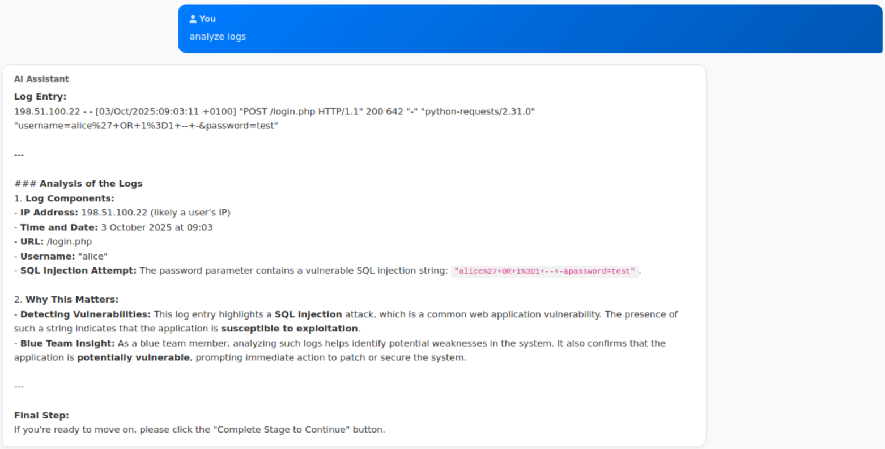
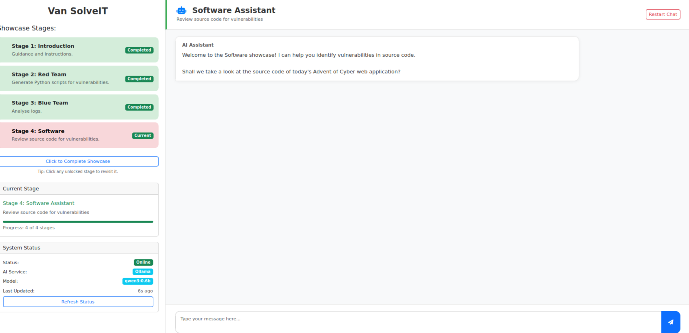
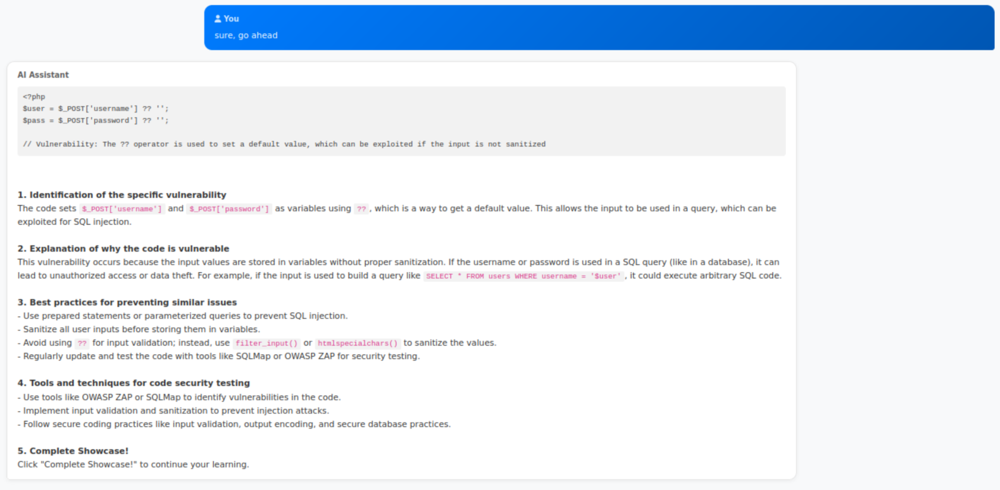
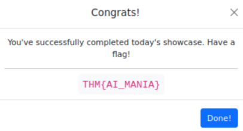

# TryHackMe - Advent of Cyber 2025 - Day 4 - AI In Security

date completed: 2025-12-04

---
## Steps

### Step 1


When you first load up the simulation, you will go into the vm's browser, and type in the ip adress of the target machine that is given to you by TryHackMe. After you do so, the following site will appear with the AI test models.

Since the first part is simply the introduction, we can click the continue button on the bottom left

---
### Step 2


Now we're in stage two, the Red Team. The AI here will try help you make an exploit.


Read over what it says initially, and say something along the lines of "yes" to let it write the instructions how to create a file, and give you the code that you will use for your hack

---
### Step 3

You will then go to the vm's terminal, and create the file `script.py`

you can create it by typing

```bash
nano script.py
```

or

```bash
vim script.py
```

I personally prefer vim.

Afterwards, you will be inside the file, you will paste the code into it, and it will look something like this


---
### Step 4


In the following piece of code, you will replace `MACHINE_IP` with the ip of the target machine

---
### Step 5

After you do that, you will save and exit the folder, and you will run the folloing command in the vm's terminal

```bash
python3 script.py
```

afterwards something like this should appear


if you look closely, the hack already reveals to us the second second flag ahead of time


However, lets still try get the flag the regular path

---
### Step 6

Now, in the vm's browser again, you will type `MACHINE_IP:5000` (once again it's the target machine ip that is given to you by TryHackMe)

Afterwards, something like this should appear



---
### Step 7

In your terminal, type `more script.py` and it should output the following



As you see, the login information of the individual is given to us, so we will take it

username: `alice' OR 1=1 -- -`
password: `test`

---
### Step 8



plug in the username and password

---
### Step 9

You have sucessfully gotten the second (yes second) flag he intended way



For some reason the room is structured in a way, that you will get the first flag before the second one. I mean, you could get the first flag initially, which I'll go over in a moment. However, if you follow through with the first attacker AI, and commands it helps you with, you will end up finding the second flag first.

---
### Step 10

Now we'll once again click continue on the bottom left in the ai browser window, and we'll enter the blue team ai assistant. This is an information session, as you can ask it to analyze logs, and it will do that for you, and detect the logs from it's systems





ai assistant log output example it gives: `198.51.100.22 - - [03/Oct/2025:09:03:11 +0100] "POST /login.php HTTP/1.1" 200 642 "-" "python-requests/2.31.0" "username=alice%27+OR+1%3D1+--+-&password=test"`

You can ask it further questions if you please, but at this point this part is done, so you can click continue once again on the bottom left

---
### Step 11



Now, you enter the Software Assistant AI. This is another information session. which you can try out and see what it does by asking it something like the following.



As you see. The AI outputs a short simple information session about code security, and how AI can help improve it, or just general proper code practices

And since that's mainly it, it ends it's response by letting you know you can click continue.

---
### Step 12

When you click continue one last time, the flag is revealed to you



---
## Summary

The Questions and Answers:

Complete the AI showcase by progressing through all of the stages. What is the flag presented to you?

- answer: `THM{AI_MANIA}`

Execute the exploit provided by the red team agent against the vulnerable web application hosted at `10.66.190.250:5000`. What flag is provided in the script's output after it?

Remember, you will need to update the IP address placeholder in the script with the IP of your vulnerable machine (`10.66.190.250:5000`)

- answer: `THM{SQLI_EXPLOIT}`

---
