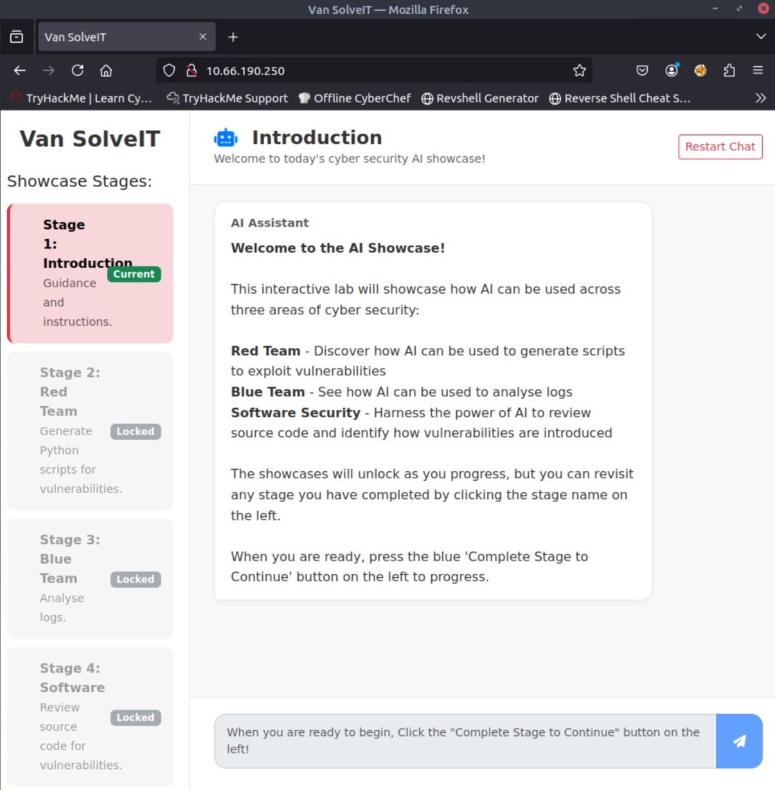
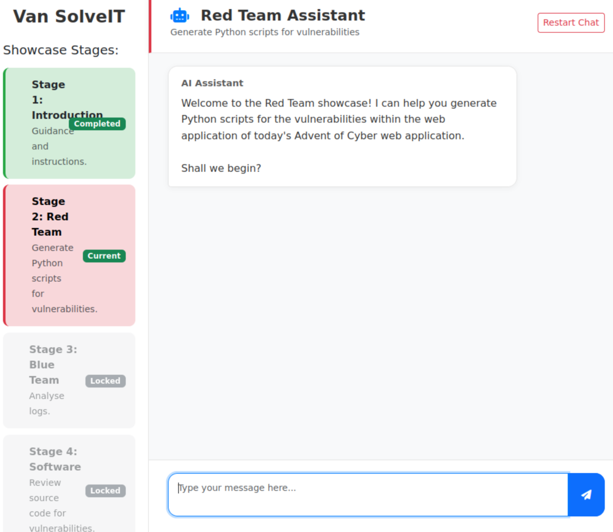
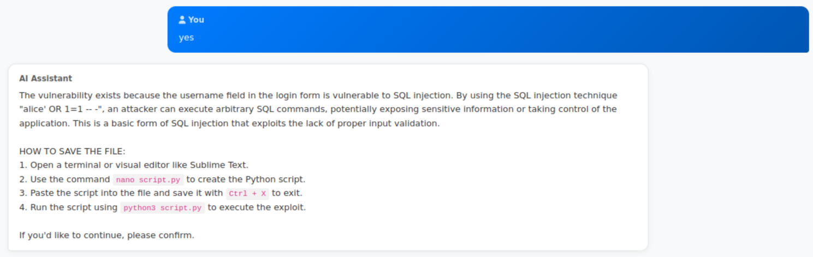
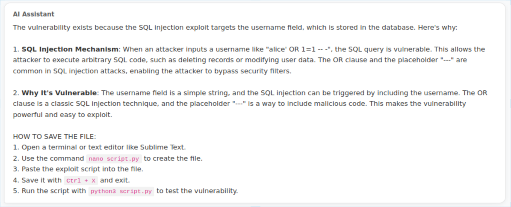
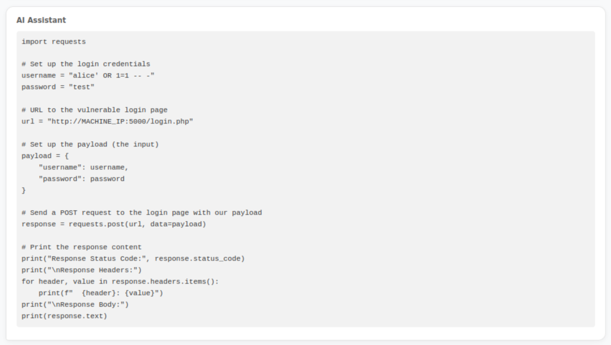
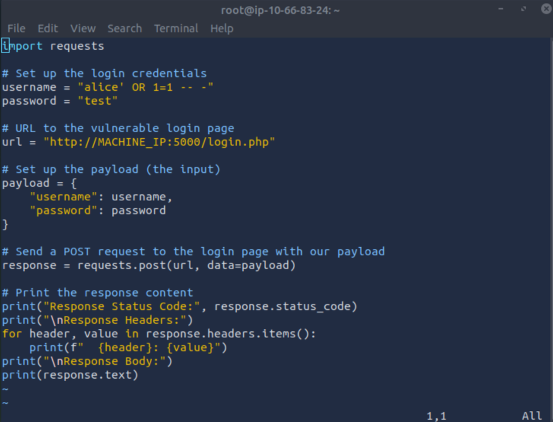
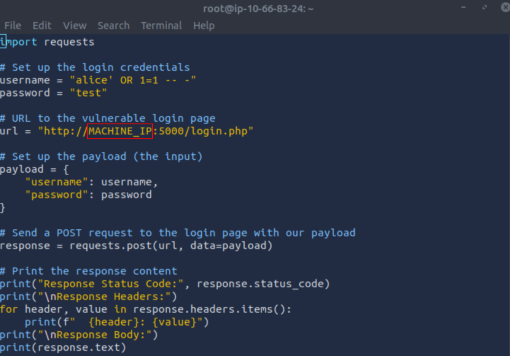
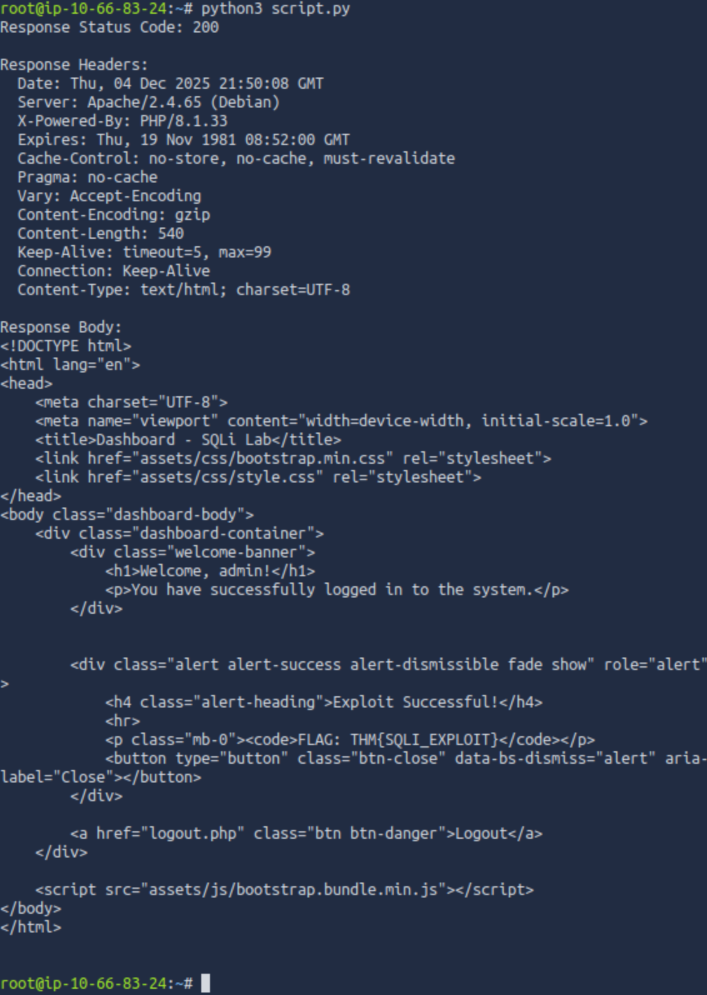
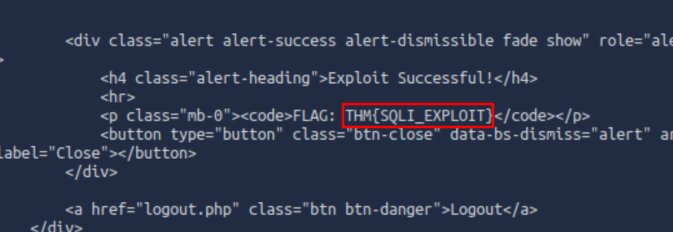

# TryHackMe - Advent of Cyber 2025 - Day 4 - AI In Security

date completed: 2025-12-04

---
## Step 1



When you first load up the simulation, you will go into the vm's browser, and type in the ip adress of the target machine that is given to you by TryHackMe. After you do so, the following site will appear with the AI test models.

Since the first part is simply the introduction, we can click the continue button on the bottom left


---
## Step 2



Now we're in stage two, the Red Team. The AI here will try help you make an exploit.








Read over what it says initially, and say something along the lines of "yes" to let it write the instructions how to create a file, and give you the code that you will use for your hack

---
## Step 3

You will then go to the vm's terminal, and create the file `script.py`

you can create it by typing

```bash
nano script.py
```

or

```bash
vim script.py
```

I personally prefer vim.

Afterwards, you will be inside the file, you will paste the code into it, and it will look something like this



---
## Step 4



In the following piece of code, you will replace `MACHINE_IP` with the ip of the target machine

---
## Step 5

After you do that, you will save and exit the folder, and you will run the folloing command in the vm's terminal

```bash
python3 script.py
```

afterwards something like this should appear



if you look closely, the hack already reveals to us the second second flag ahead of time



However, lets still try get the flag the regular path

---